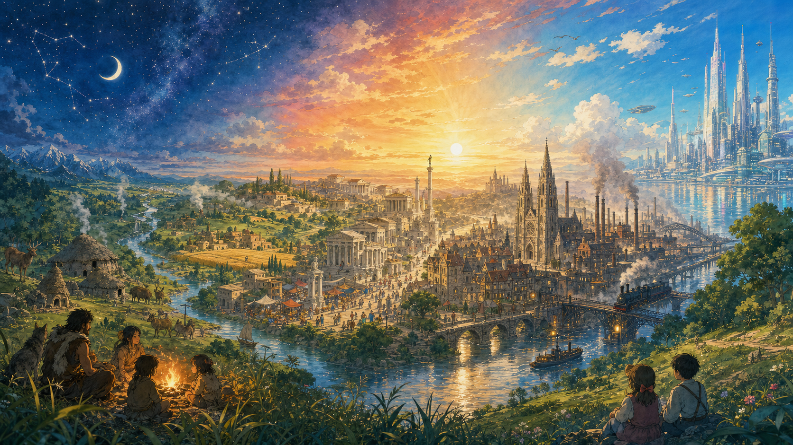
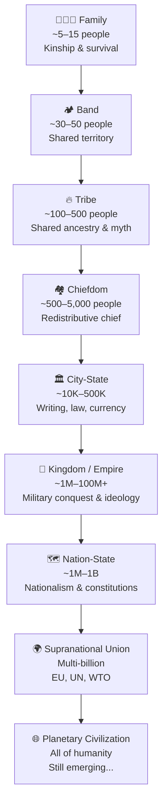

# Chapter 1: The Long Arc of Civilization

Imagine standing at the dawn of human history, tracing the vast trajectory that has brought us from the first hunter-gatherer communities to the brink of a post-capitalist future. The journey of our species is not merely a chronicle of time passing, but a story of profound transformations — each stage shaped by the tools we invent, the resources we steward, and the ideas we dare to imagine. And woven through this story, like a golden thread, is a recurring pattern: every great leap forward in human civilization has been triggered by a revolution — a sudden, irreversible shift in what we know, what we can do, and how we organize ourselves. But between those revolutions lie something equally instructive: the roads not taken, the libraries burned, the steam engines built as temple toys, and the flowers chosen over swords.

---

*From the first campfire to the gleaming cities of tomorrow — a river of time flows through every age of human achievement, connecting each era to the next. The story of civilization is not a series of isolated chapters but a single, unbroken arc: each revolution building on the ruins and wisdom of the one before it.*

---

## The Cognitive Revolution: The Spark That Lit the Fire

Our story begins not with cities or farms or factories, but with a transformation so subtle and so profound that it left no monument, no ruin, no artifact that could fully capture its magnitude. Approximately seventy thousand years ago, something changed in the human mind. Scholars call it the Cognitive Revolution — the moment when Homo sapiens, a species that had existed for hundreds of thousands of years, suddenly began to think, communicate, and cooperate in ways no creature on Earth had ever done before.

What changed? Language — not merely the ability to make sounds, but the capacity to construct and share complex narratives about things that did not exist: gods, nations, laws, money, and futures not yet lived. The philosopher and historian Yuval Noah Harari calls these constructions *shared fictions* — and the word "fiction" should not mislead you. A dollar bill is objectively nothing but cotton and ink. But within the shared belief system of eight billion people, it is a claim on the productive output of the entire global economy. Remove the shared belief, and it becomes nothing. The power of civilization is not physical. It is the power of stories that enough people believe simultaneously. The Cognitive Revolution gave our ancestors that power.

With this new cognitive toolkit, Homo sapiens spread across the globe with astonishing speed. From the savannas of Africa to the frozen tundras of Siberia, from the islands of the Pacific to the tip of South America, our ancestors colonized every habitable corner of the Earth within a geological eyeblink. Wherever they went, they brought with them the most powerful technology ever invented: the ability to tell stories that others would believe and act upon.

## Hunter-Gatherer Societies: The Foundation of Human Organization

For most of the time since the Cognitive Revolution, our ancestors lived as hunter-gatherers — small, nomadic bands moving with the seasons, following the herds, reading the rhythms of the land. These communities were tightly knit, their survival dependent on the bounty of the natural world and the skill of every member. There was no surplus, no private property, and no rigid hierarchy. Decisions were made collectively, and the fruits of labor were shared among all. Life was precarious, but it was also egalitarian and deeply connected to nature.

Do not dismiss this way of life as primitive. The hunter-gatherer stage is the most enduring form of human organization in all of history — lasting tens of thousands of years, compared to the mere centuries of industrial capitalism. Our bodies, our social instincts, our capacity for empathy and cooperation — all were shaped by this long era. And there is a melancholy irony here that the historian Harari does not let us forget: the skeletal record shows that the first farmers were *shorter*, had *more* dental disease, *more* infectious illness, and *fewer* dietary nutrients than their hunter-gatherer predecessors. Agriculture may have been, in his haunting phrase, history's greatest fraud — a trap that produced more people but, on average, worse lives. The species won. The individual often lost.

## The Agricultural Revolution: Settled Communities and the Birth of Surplus

Then, roughly ten thousand years ago, everything changed again. In a handful of places around the world — the Fertile Crescent of the Middle East, the river valleys of China, the highlands of Mesoamerica — human beings learned to cultivate crops and domesticate animals. This was the Agricultural Revolution, and it was as consequential as any event in the story of our species.

Agriculture allowed humans to settle in one place. Surplus food meant that not everyone had to work directly for sustenance. Specialized roles emerged: craftspeople, traders, priests, and rulers. For the first time in human history, it was possible for some people to live entirely off the labor of others. This was not a trivial development. It was the birth of class society — and with it, the birth of exploitation.

But the agricultural revolution also set a trap that civilization has been falling into ever since. As Nassim Nicholas Taleb would observe millennia later, every efficiency gain in a complex system also creates new fragility. The hunter-gatherer who lost their shelter could move. The farmer who lost their harvest could starve. The city that lost its grain stores could collapse. Agriculture gave humanity the ladder of civilization — and removed the safety net beneath it.

## The Urban Revolution: Cities, Writing, and the Birth of Civilization

Surplus did not merely feed more people. It built cities. By around five thousand years ago, the first urban centers were rising along the great rivers of the ancient world — the Tigris and Euphrates in Mesopotamia, the Nile in Egypt, the Indus in South Asia, the Yellow River in China. This was the Urban Revolution, and with it came writing, formal governance, long-distance trade, and monumental architecture.

Writing emerged first as a tool for keeping accounts — tracking grain, cattle, and debts — and then as a medium for law, literature, and the transmission of knowledge across generations. Here is a thought that should give you pause: every civilization before the invention of writing had to reinvent everything from scratch with each new generation. Writing changed that. For the first time, the dead could teach the living.

And yet, with cities came new forms of oppression. Slavery became widespread and systematic. The surplus that freed some people from labor bound others to it by force. The rise of slavery embedded inequality into the very foundations of civilization — a debt that humanity would not begin to repay for another four thousand years.

## The Bronze Age Collapse: When Civilization Fell

Yet civilizations, however mighty, are not immune to catastrophe. Around 1200 BCE, the great palace-based civilizations of the Eastern Mediterranean — the Mycenaean Greeks, the Hittites, the Egyptians of the New Kingdom, the Canaanite city-states — disintegrated almost simultaneously. Trade networks collapsed. Writing systems were lost. Cities were abandoned or burned. Populations plummeted.

The political scientist Peter Turchin would recognize in this collapse the signature of a disintegrative phase at its most extreme: elite overproduction, wealth concentration, fiscal exhaustion of central states, and then the cascading failure of the deeply interdependent systems that held them together. The rigid, palace-centered economies of the ancient world — dependent on long-distance trade, specialized labor, and centralized administration — were devastatingly fragile when multiple systems failed at once. Taleb would call it a textbook example of a system optimized for efficiency and thereby made catastrophically brittle.

The collapse was not merely political. It was an act of civilizational forgetting. The Library of Nineveh, built by the Assyrian king Ashurbanipal in the 7th century BCE and housing tens of thousands of clay tablets — including the Epic of Gilgamesh, humanity's oldest written story — was destroyed when Nineveh fell in 612 BCE. Centuries later, in 48 BCE, Julius Caesar's forces accidentally burned part of the Library of Alexandria — and what Roman fundamentalism and later mob violence spared, time consumed. Stop for a moment and feel the weight of that loss. We do not know what was in those libraries. We do not know what knowledge was reinvented painfully centuries later, or what knowledge was simply never recovered. There are historians who argue, with uncomfortable plausibility, that if the Library of Alexandria had survived and its intellectual tradition had continued unbroken, humanity might have reached the scientific revolution by the 6th or 7th century AD — placing us, today, not on the threshold of a post-scarcity civilization, but already living inside one. Instead, a mob tore it apart, and we lost a thousand years.

## The Tragedy of Rediscovery: Inventions the World Was Not Ready For

This is perhaps the most melancholy theme in the history of civilization: the invention that arrived too early, found no institutional home, and vanished — only to be painfully reinvented centuries or millennia later.

Around 50 AD, a Greek engineer and mathematician named Hero of Alexandria built a device he called the aeolipile — a hollow sphere mounted on a pivot, with two curved nozzles through which steam would escape, causing the sphere to spin. It was, in every essential principle, a steam engine. Hero also designed programmable carts, automatic theatre doors, wind-powered organs, and force pumps. He lived in a world that was, in nearly every material respect, ready for an industrial revolution — abundant metal, sophisticated mathematics, large-scale construction, long-distance trade. And yet his steam engine became a temple toy, used to make the doors of a shrine swing open mysteriously, to awe worshippers with apparent divine presence. It never powered a loom. It never pumped a mine. It sat, spinning gently, for fifteen hundred years until James Watt rediscovered its principle in 1765.

Why? The answer is not that the Romans lacked intelligence. It is that the Roman economy ran on slaves. When labor is free, there is no economic incentive to replace it with machinery. The institution of slavery did not merely oppress human beings — it arrested the technological development of the entire civilization. Taleb would frame it as a skin-in-the-game failure: the people who owned the slaves bore none of the costs of their inefficiency; the people who suffered under the system had no voice in changing it.

The Antikythera mechanism, recovered from a Greek shipwreck and dated to around 100 BCE, is an analogue computer of breathtaking sophistication — a bronze device of at least 30 gears capable of predicting astronomical positions and eclipses decades in advance. Nothing of comparable mechanical complexity appears in the historical record for another 1,400 years. Bi Sheng in China invented movable-type printing around 1040 AD — four centuries before Gutenberg. The Chinese invented gunpowder, the compass, paper, cast iron, and the mechanical clock, each centuries before their European reinvention. These were not failures of genius. They were failures of *institutional scaffolding* — the economic incentives, social mobility, intellectual property norms, and competitive pressures that transform a brilliant invention into a civilization-changing technology.

The lesson is not simply that good ideas are often lost. It is that a great invention can sit in plain sight, spinning uselessly, if the society around it is not organized to receive it.

## The Philosophical Revolution: When Humanity Learned to Question Itself

In the centuries following the Bronze Age Collapse, as the ancient world slowly rebuilt itself, something unprecedented happened. Between roughly 800 and 200 BCE — a period Karl Jaspers called the Axial Age, and which we might more vividly name the **Philosophical Revolution** — human beings in widely separated parts of the world independently arrived at a new way of thinking about themselves, their societies, and their place in the cosmos.

In Greece, Socrates walked the streets of Athens asking uncomfortable questions. In India, Siddhartha Gautama sat beneath a bodhi tree and emerged as the Buddha, teaching a path of compassion and inner liberation. In China, Confucius articulated the ethical foundations of a just society. In Persia, Zoroaster proclaimed a cosmic struggle between good and evil. In Israel, the Hebrew prophets demanded social justice and moral accountability from kings and commoners alike.

These were not isolated movements. They were a revolution in human consciousness — the birth of what we might call the *reflective mind*: the capacity to step back from the immediate pressure of survival and ask: *What is the good life? What makes a just society? What do we owe one another?* These questions, once asked, could never be unasked.

And here is something remarkable: one of the greatest expressions of this reflective tradition was born not from safety, but from catastrophe. When the Mongols swept across Central Asia in the 13th century, destroying cities with a methodical brutality that the ancient world had rarely seen, a poet's family fled from Bactria — a region that had been, for centuries before the Islamic conquest, a stronghold of Buddhist philosophy. The Mongols were, by any conventional military measure, invincible. Their cavalry was the most lethal force in the medieval world. They could not be beaten on the battlefield.

So Jalal ad-Din Rumi chose a different battlefield. He wrote poems about love. He spun verses about the longing of the soul for union with the divine. He founded a tradition of whirling meditation that turned the body itself into a prayer. And in doing so, he accomplished something that no army had managed: he inverted the entire meaning of the Mongol conquests. The conquerors swept away cities, rerouted trade, and erased populations — yet every village they burned became, in retrospect, a footnote in the story Rumi was writing. The parallels with Buddhist non-attachment and Taoist *wu wei* — the philosophy of effortless action — are not coincidental. Rumi's homeland had breathed Buddhist air for generations. When the violence became unbearable, the deepest philosophical tools available were those that had been quietly composting in the soil for centuries. The mystic and the meditator arrived at the same truth from different directions: that the only power the conqueror cannot seize is the one you stop needing to defend.

The Philosophical Revolution teaches us what the military historians often miss: ideas are not merely decorations on the surface of civilization. They are its immune system.

## The Paths Not Taken: What Civilizations Chose Not to Do

One of the most revealing things about any civilization is not what it invented, but what it chose *not* to use.

The Inca of South America knew about the wheel. Archaeologists have found wheeled toys in sites across Mesoamerica — small ceramic animals on axles, clearly designed for rolling. But the Inca never scaled the wheel into a vehicle, never built a cart, never harnessed it to agriculture or transport. Why? Because they had no draft animals capable of pulling a cart. The llama, their primary beast of burden, is too small and too stubborn. Without the horse or the ox, the wheel was an interesting curiosity rather than a transformative tool. The Inca instead built the most sophisticated road network in the pre-Columbian Americas — 40,000 kilometers of stone paths — and ran it with human relay runners. They arrived at a different solution to the same problem. The wheel was not beyond their imagination. It was simply not their answer.

The Maya were, by any measure, mathematical geniuses. They independently invented the concept of zero, developed one of the most accurate calendars in the ancient world, and built cities of extraordinary complexity. Yet their civilization collapsed not because of conquest, but because of drought and deforestation — they had solved the equations of the cosmos but had not solved the equations of their own water supply. Advanced mathematics and catastrophic environmental management coexisted in the same civilization. Even genius does not protect you from the problems you choose not to look at.

The Aztec empire had a unique philosophy of warfare. Rather than trying to kill their enemies, Aztec warriors aimed to *capture* them alive for later ritual sacrifice. These were called the Flower Wars — ritualized conflicts in which honor lay not in slaughter but in the elegance of capture. It was a martial philosophy of extraordinary internal coherence. It was also catastrophically ill-suited to fighting the Spanish, who had no interest in being captured gracefully and every interest in killing everyone in front of them as efficiently as possible. The Aztec warriors, trained for a millennium in the art of taking prisoners, found themselves in a battle where their own excellence was their fatal handicap.

In ancient Greece, armies sometimes resolved their conflicts through single combat — two champions stepping forward to fight on behalf of their entire forces, sparing both sides the carnage of full battle. The Iliad celebrates this tradition; David and Goliath encodes it in scripture. In pre-Islamic Arabia, tribal conflicts were sometimes decided not by armies at all, but by poets. The great oral competitions of the Mu'allaqat — the Hanging Odes, so celebrated they were said to be inscribed in gold and hung on the walls of the Kaaba — were, among other things, instruments of tribal prestige and conflict resolution. Whichever tribe could field the more devastating poem sometimes won the argument without drawing a blade.

These are not curiosities. They are evidence that the rules of civilization are not laws of nature. They are choices — cultural agreements, dressed up as necessity, that can be changed. Sometimes those choices lead to flourishing. Sometimes, when the world changes and the choices do not, they lead to extinction. And sometimes — as with the aeolipile spinning silently in its temple — they lead to fifteen hundred years of waiting for someone to ask a different question.

## The Black Death: Plague as Accidental Liberation

In 1347, the Black Death arrived in Sicily on Genoese trading ships returning from the Black Sea. Within four years, it had killed between a third and half of Europe's entire population — somewhere between 25 and 50 million people. It was the greatest demographic catastrophe in recorded Western history, a visitation of suffering so immense that it shattered the medieval world's psychological certainty about God, order, and the naturalness of hierarchy.

And then, paradoxically, it liberated the survivors.

With so many dead, labor became scarce for the first time in centuries. Serfs who had been bound to their lord's land for generations could suddenly walk away and find another lord willing to pay them. Wages rose. Working conditions improved. The feudal contract — protection in exchange for labor — began to dissolve, not because of revolution or philosophy, but because the mathematics of supply and demand had, for once, turned in the worker's favor. The Black Death did not end feudalism alone, but it cracked its foundations irrevocably.

Taleb would recognize this as a Black Swan that proved antifragile in its aftermath: an event of catastrophic suffering that, by destroying the rigid structures it shattered, created conditions for new growth. The medieval world was fragile. The Renaissance that followed it was not. This is one of history's most disturbing patterns: sometimes it takes catastrophe to break the chains that comfort had made invisible.

## Feudalism: The Plow and the Manor

The centuries between the fall of Rome and the Renaissance saw another technological shift reshape social organization. The heavy plow, the horse collar, and the systematic rotation of crops transformed the productivity of northern European soil. These innovations supported the rise of feudalism — a system in which serfs worked the land for lords in exchange for protection and a share of the harvest.

Feudalism was characterized by a rigid social hierarchy, with power concentrated in a landed aristocracy. Yet even within its confines, the seeds of the next revolution were quietly germinating. Universities appeared in medieval Europe. The rediscovery of ancient Greek texts, transmitted through Arabic scholars, reintroduced the tools of rational inquiry. The printing press, invented by Gutenberg around 1440, would soon shatter the monopoly of church and aristocracy over the written word — democratizing knowledge on a scale the ancient world could never have imagined.

But this, too, carried its paradox: the same press that spread Erasmus's humanism spread Luther's polemics, which lit a religious war that consumed Europe for a century. The same technology that made the Reformation possible made the Thirty Years' War inevitable. Harari's warning, written five centuries later, applies with perfect precision: information technology does not automatically produce enlightenment. It amplifies whatever already exists — wisdom and madness with equal fidelity. Gutenberg did not give humanity truth. He gave humanity volume.

## The Scientific Revolution: Reason Conquers the Cosmos

In 1543, Nicolaus Copernicus published a book suggesting that the Earth moved around the Sun. Within a century and a half, Galileo had confirmed it through a telescope, and Isaac Newton had described the mathematical laws governing every object in the universe, from a falling apple to an orbiting planet. The Scientific Revolution was not merely a collection of discoveries. It was the birth of a *method* — the systematic use of observation, experiment, and mathematical reasoning to understand the natural world.

The Scientific Revolution did not immediately transform economies or social structures. But it laid the intellectual foundations for everything that followed. It taught humanity that the world could be understood, and if understood, transformed. It also, quietly, began the long process of dissolving the shared fictions that had held medieval civilization together — and it did not immediately offer new ones to replace them. That vacuum would be filled, in time, by nationalism, capitalism, and science itself — each a new story powerful enough to coordinate millions of strangers who had never met.

## The Industrial Revolution: Machines, Factories, and the Birth of Capitalism

The transformation came in the second half of the eighteenth century, first in Britain, then spreading across Europe and North America with unstoppable momentum. The Industrial Revolution — powered by the steam engine (the one Hero built as a toy, finally set to work), the mechanized loom, the blast furnace — was the most dramatic economic transformation since the Agricultural Revolution ten thousand years before.

Factories replaced workshops. Cities swelled with workers drawn from the countryside. Mass production made goods available at prices previous generations could not have imagined. And with it rose a new social class: the industrial capitalist, who owned the machines, the factories, and the raw materials, and who hired the labor of others in exchange for wages. The old relationship between lord and serf gave way to a new one between employer and employee — formally free, but bound by economic necessity.

Ray Dalio, in his study of five centuries of empire cycles, identifies this moment as the beginning of the longest and most consequential long-term debt cycle in modern history: the birth of the financial capitalism whose terminal phase we may now be living through. The Industrial Revolution did not merely change how things were made. It changed what kind of civilization was possible — and what kinds of collapse were now, for the first time, truly global.

## The Organizational Ladder: How We Scaled Cooperation

Look back across the full arc of this history and you can trace a single thread: the progressive expansion of the scale at which human beings cooperate. Each leap in scale required a new shared fiction powerful enough to bind strangers — a new Hararian intersubjective reality that could hold together people who had never met and never would.

Each rung of this ladder required not just more powerful technology, but more powerful stories. A band holds together through personal loyalty. A tribe holds together through shared ancestry and myth. A city-state holds together through law, currency, and the shared fiction of civic identity. An empire holds together through ideology — religious, national, or otherwise. The European Union holds together through a shared commitment to liberal norms and economic interdependence. A planetary civilization, if it comes, will require a story big enough to hold all of humanity — a fiction more universal than any nation, any religion, any empire that has ever existed.

Peter Turchin would observe that each level of this hierarchy also requires higher and higher asabiyyah — the social cohesion that allows groups to act collectively. And he would warn that asabiyyah at large scales is fragile: it builds slowly, under pressure, and dissolves quickly, in luxury.

## The Recurring Pattern: Cycles Within Cycles

Step back far enough, and history reveals itself not as a straight line of progress, but as a spiral — returning to familiar shapes at each turn, but at a different altitude.

Ibn Khaldun, the 14th-century Arab historian writing in the shadow of civilizations he had watched collapse, was the first to systematize this insight. Every dynasty, he argued, is born from a group with high asabiyyah — the fierce social solidarity of people who have struggled together and have no excess to corrupt them. They conquer. They settle. They grow wealthy. Luxury dissolves their solidarity. A new hungry group, forged in hardship on the frontier, eventually displaces them. The cycle repeats — not because of fate, but because of the internal logic of power and comfort.

Turchin formalized this into mathematics. Dalio traced the same pattern across five centuries of empires. The Indian philosopher P.R. Sarkar identified a cycle of social dominance that rotates between four human types: the laborer, who endures; the warrior, who conquers; the intellectual, who legitimizes; and the merchant, who monetizes. When the merchant class exhausts its cycle — when the financial system becomes so extractive that it impoverishes the many for the benefit of the few — the laborers rebel, the warriors arise, and the cycle restarts. Every revolution in history, Sarkar argued, is simply this wheel completing another turn.

We are not the first civilization to face this moment. We are merely the latest.

## Collapse and Resurrection: The Civilizations That Chose to Live

And yet history also contains, alongside its elegies of destruction, something more surprising: civilizations that were ground to dust and chose to rise anyway.

The conquests of the Aztec and Inca were among the most demographically catastrophic events in human history. Disease — primarily smallpox, to which the indigenous peoples of the Americas had no immunity — killed an estimated 90% of the population of some regions within a century of first contact. Entire civilizations, with their languages, their calendars, their astronomical knowledge, their architectural traditions, vanished within a human lifetime. The loss is incalculable. We will never know what cures those healers knew, what stars those astronomers had named, what stories those poets had memorized.

But then consider Germany in 1945. Its cities were rubble. Its infrastructure was destroyed. Its industrial base had been systematically dismantled by Allied bombing. Its population had been decimated by six years of total war. It had no significant natural resources. Within thirty years, it was one of the most prosperous and stable societies in human history — what the economists called the *Wirtschaftswunder*, the economic miracle. Japan told the same story: firebombed, atomized, occupied, and stripped of empire — and yet within a generation, the most export-competitive economy on Earth, with no oil, no iron ore, no coal to speak of. Turkey, emerging from the total collapse of the Ottoman Empire and the devastation of the War of Independence, rebuilt itself from almost nothing into a functioning modern state within a single generation.

What explains these resurrections? Turchin would point to asabiyyah — the way that extreme collective suffering, paradoxically, regenerates the social solidarity that prosperity erodes. Jiang Xueqin would apply his OEC framework: the nations that recovered were those that became maximally **Open** to new ideas and outside help, maximally **Energetic** in their organizational drive, and maximally **Cohesive** in their collective identity under pressure. George Friedman would add the geographic dimension: Germany, Japan, and Turkey all occupied strategically irreplaceable positions in their regional systems — their partners needed them to succeed.

But perhaps the simplest answer is also the deepest: these societies had stories powerful enough to survive catastrophe. Germany reforged its identity around constitutional democracy and industrial excellence. Japan channeled its warrior culture into economic competition. Turkey built a new civic nationalism from the ruins of a multicultural empire. The story survived when everything else was destroyed. And the story was enough.

## Technology as the Engine of Change

Look back across this long arc of civilization, and a pattern emerges. The Cognitive Revolution gave us language and collective imagination. The Agricultural Revolution gave us surplus and settlement. The Urban Revolution gave us cities and writing. The Philosophical Revolution gave us the reflective mind. The Scientific Revolution gave us the method of reason. The Industrial Revolution gave us the machine and the market. Each transformation was triggered, at least in part, by a new technology or a new way of thinking — and each one reshaped the social, economic, and political order of its time.

But technology does not act in isolation. Hero of Alexandria's steam engine demonstrates that genius without institutional scaffolding changes nothing. The Library of Alexandria demonstrates that knowledge without antifragile distribution is a single point of failure waiting to burn. The Aztec Flower Wars demonstrate that a civilization can be destroyed not by inferior intelligence but by a cultural convention that made perfect sense until the day it met a culture with different conventions and no interest in playing by them.

## Looking Ahead: The Next Revolution

As we stand at the threshold of a new era, the lessons of history are not comforting — but they are clarifying. We have been here before. Not exactly here, not with these specific tools and these specific crises, but in the structural position of a civilization reaching the end of one cycle and the beginning of another.

The revolutions we have lived through — cognitive, agricultural, urban, philosophical, scientific, industrial — have each in turn transformed what it means to be human. Now, a new revolution is underway, driven by artificial intelligence, renewable energy, biotechnology, and the first tentative reach toward the stars. And as with every revolution before it, this one will reshape not only our economies and our institutions, but our deepest assumptions about who we are and what we are for.

The steam engine sat spinning as a temple toy for fifteen hundred years. The Library of Alexandria burned. The Aztec warriors captured their enemies with exquisite precision, right up until the moment the Spanish arrived. We do not have to repeat these stories. But to avoid repeating them, we first have to understand them.

The tools are in our hands. The question, as always, is what we will build with them — and what we will choose, this time, *not* to leave as a toy.
